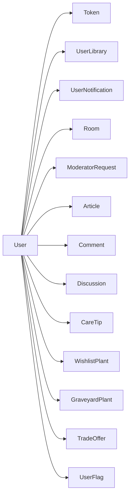
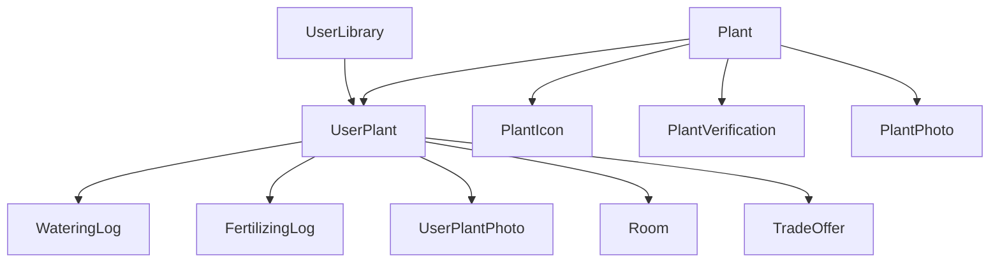
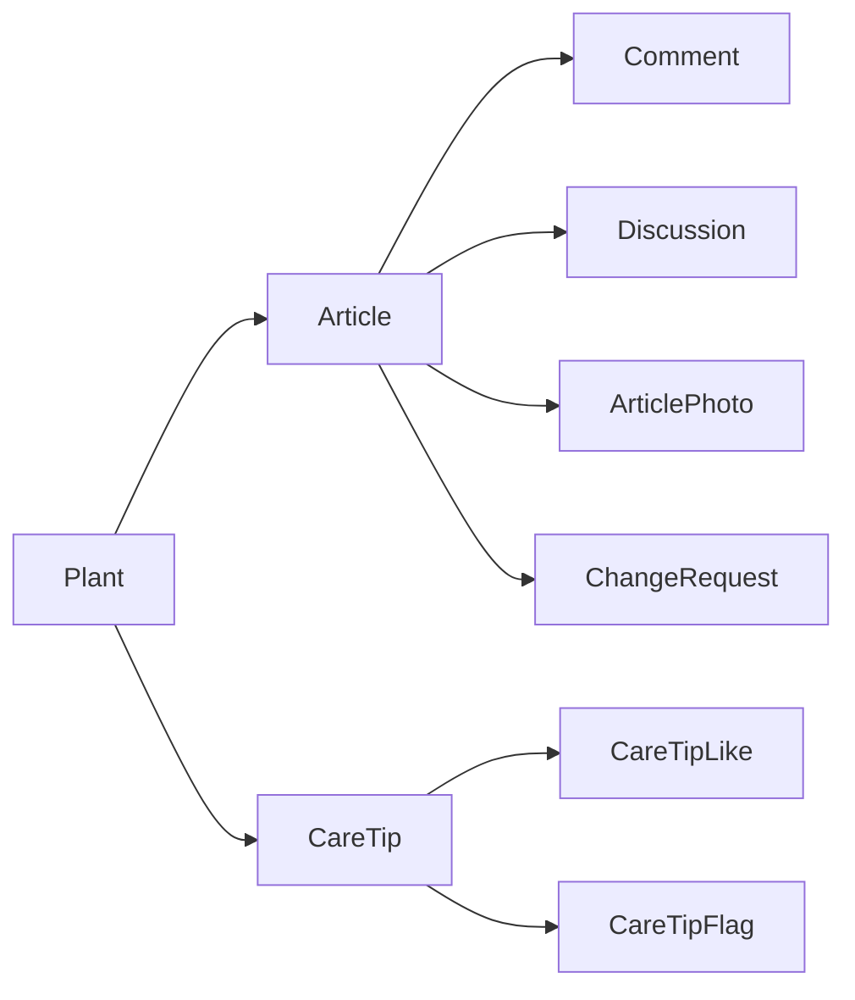
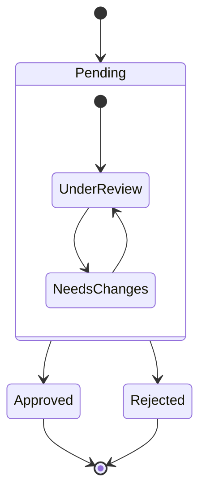
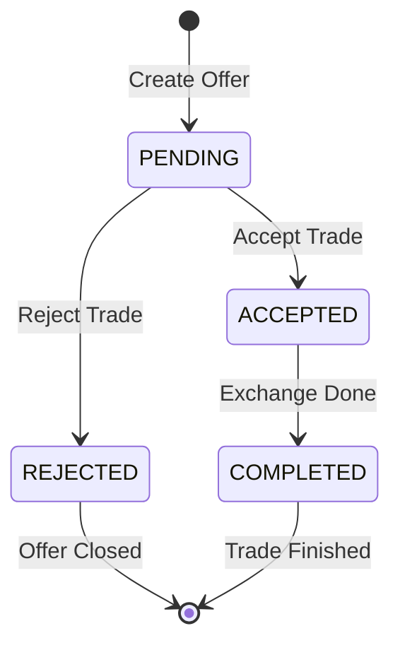

# Plant Management System - Database Models Documentation

## Table of Contents
1. [System Overview](#system-overview)
2. [Core User System](#core-user-system)
3. [Plant Management](#plant-management)
4. [Content Management](#content-management)
5. [Moderation System](#moderation-system)
6. [Trading System](#trading-system)

## System Overview

### Complete System Architecture

```mermaid
graph TB
    subgraph "Core User System"
        User[User]
        Token[Token]
        UserLibrary[UserLibrary]
        UserNotification[UserNotification]
    end

    subgraph "Plant Management"
        Plant[Plant]
        UserPlant[UserPlant]
        Room[Room]
        WateringLog[WateringLog]
        FertilizingLog[FertilizingLog]
        UserPlantPhoto[UserPlantPhoto]
        PlantIcon[PlantIcon]
    end

    subgraph "Content Management"
        Article[Article]
        Comment[Comment]
        Discussion[Discussion]
        ArticlePhoto[ArticlePhoto]
        CareTip[CareTip]
        CareTipLike[CareTipLike]
    end

    subgraph "Moderation System"
        ModeratorRequest[ModeratorRequest]
        ChangeRequest[ChangeRequest]
        UserFlag[UserFlag]
        CareTipFlag[CareTipFlag]
        Approval[Approval]
        PlantVerification[PlantVerification]
    end

    subgraph "Trading System"
        TradeOffer[TradeOffer]
        WishlistPlant[WishlistPlant]
        GraveyardPlant[GraveyardPlant]
    end

    User --> Token
    User --> UserLibrary
    User --> UserNotification
    User --> Room
    User --> ModeratorRequest
    User --> Article
    User --> Comment
    User --> Discussion
    User --> CareTip
    User --> CareTipLike
    User --> WishlistPlant
    User --> GraveyardPlant
    User --> TradeOffer
    User --> UserFlag
    User --> PlantVerification

    UserLibrary --> UserPlant
    Plant --> UserPlant
    Plant --> Article
    Plant --> CareTip
    Plant --> PlantIcon
    Plant --> PlantVerification

    UserPlant --> WateringLog
    UserPlant --> FertilizingLog
    UserPlant --> UserPlantPhoto
    UserPlant --> Room
    UserPlant --> TradeOffer

    Article --> Comment
    Article --> Discussion
    Article --> ArticlePhoto
    Article --> ChangeRequest

    ChangeRequest --> Approval
    CareTip --> CareTipFlag
    CareTip --> CareTipLike
```

## Core User System

### Entity Relationships

### Schema Tables

#### User
| Field | Type | Description | Constraints |
|-------|------|-------------|-------------|
| id | Int | Primary key | @id @default(autoincrement()) |
| username | String | Username | @unique |
| email | String | Email address | @unique |
| password | String | Hashed password | Required |
| profilePicture | String? | Profile image URL | Optional |
| role | UserRole | User role | @default(USER) |
| createdAt | DateTime | Creation timestamp | @default(now()) |
| updatedAt | DateTime | Update timestamp | @updatedAt |
| strikes | Int | Strike count | @default(0) |
| isBanned | Boolean | Ban status | @default(false) |
| banExpiresAt | DateTime? | Ban expiration | Optional |
| lastActive | DateTime | Last activity | @default(now()) |

#### Token
| Field | Type | Description | Constraints |
|-------|------|-------------|-------------|
| id | Int | Primary key | @id @default(autoincrement()) |
| userId | Int | User reference | FK |
| token | String | Token value | @unique |
| type | TokenType | Token type | Required |
| expiresAt | DateTime | Expiration time | Required |
| isActive | Boolean | Active status | @default(true) |

## Plant Management

### Entity Relationships

### Schema Tables

#### Plant
| Field | Type | Description | Constraints |
|-------|------|-------------|-------------|
| id | Int | Primary key | @id @default(autoincrement()) |
| name | String | Plant name | Required |
| scientificName | String | Scientific name | @unique |
| commonName | String | Common name | Required |
| family | String | Plant family | Required |
| icon | String | Icon path | Required |
| light | String | Light needs | Required |
| temperature | String | Temperature range | Required |
| soil | String | Soil type | Required |
| climate | String | Climate info | Required |
| humidity | String | Humidity needs | Required |
| growthCycle | String | Growth pattern | Required |
| toxicity | String | Toxicity info | Required |
| petSafe | Boolean | Pet safety | Required |
| plantType | String | Plant type | Required |

#### UserPlant
| Field | Type | Description | Constraints |
|-------|------|-------------|-------------|
| id | Int | Primary key | @id @default(autoincrement()) |
| libraryId | Int | Library reference | FK |
| plantId | Int | Plant reference | FK, @unique |
| nickname | String? | Custom name | Optional |
| acquiredDate | DateTime | Acquisition date | Required |
| notes | String? | Care notes | Optional |

## Content Management

### Entity Relationships

### Schema Tables

#### Article
| Field | Type | Description | Constraints |
|-------|------|-------------|-------------|
| id | Int | Primary key | @id @default(autoincrement()) |
| title | String | Article title | Required |
| content | String | Article content | Required |
| plantId | Int | Plant reference | FK, @unique |
| createdAt | DateTime | Creation time | @default(now()) |
| updatedAt | DateTime | Update time | @updatedAt |

[Additional tables follow same pattern...]

## Moderation System

### Process Flow

### Schema Tables

#### ModeratorRequest
| Field | Type | Description | Constraints |
|-------|------|-------------|-------------|
| id | Int | Primary key | @id @default(autoincrement()) |
| userId | Int | User reference | FK |
| status | ModeratorRequestStatus | Request status | @default(PENDING) |
| createdAt | DateTime | Creation time | @default(now()) |
| updatedAt | DateTime | Update time | @updatedAt |

## Trading System

### Trade Flow

### Schema Tables

#### TradeOffer
| Field | Type | Description | Constraints |
|-------|------|-------------|-------------|
| id | Int | Primary key | @id @default(autoincrement()) |
| offererId | Int | Offering user | FK |
| recipientId | Int | Receiving user | FK |
| offeredPlantId | Int | Plant offered | FK |
| requestedPlantId | Int | Plant requested | FK |
| status | TradeStatus | Trade status | Required |
| message | String? | Trade message | Optional |
| createdAt | DateTime | Creation time | @default(now()) |
| updatedAt | DateTime | Update time | @updatedAt |

## Enums

### User Related
- **UserRole**: `USER`, `MODERATOR`, `ADMIN`
- **TokenType**: `PASSWORD_RESET`, `ACCOUNT_VERIFICATION`, `ONE_TIME_LOGIN`, `DEACTIVATION`

### Room Related
- **RoomType**: `LIVING_ROOM`, `BEDROOM`, `BATHROOM`, `KITCHEN`, `BALCONY`, `OUTDOOR`, `GREENHOUSE`

### Moderation Related
- **ModeratorRequestStatus**: `PENDING`, `APPROVED`, `REJECTED`
- **RequestStatus**: `PENDING`, `APPROVED`, `REJECTED`
- **VerificationStatus**: `PENDING`, `APPROVED`, `REJECTED`
- **IconStatus**: `PENDING`, `APPROVED`, `REJECTED`

### Trade Related
- **TradeStatus**: `PENDING`, `ACCEPTED`, `REJECTED`, `COMPLETED`

### Notification Related
- **NotificationType**: `FRIEND_REQUEST`, `ARTICLE_COMMENT`, `CHANGE_REQUEST_APPROVED`, `CHANGE_REQUEST_REJECTED`

## Secondary Tables

### User Related Tables

#### UserLibrary
| Field | Type | Constraints |
|-------|------|-------------|
| id | Int | @id @default(autoincrement()) |
| userId | Int | FK, @unique |

#### UserNotification
| Field | Type | Constraints |
|-------|------|-------------|
| id | Int | @id @default(autoincrement()) |
| type | NotificationType | Required |
| content | String | Required |
| relatedId | Int? | Optional |
| read | Boolean | @default(false) |
| userId | Int | FK |
| createdAt | DateTime | @default(now()) |

### Plant Care Tables

#### WateringLog
| Field | Type | Constraints |
|-------|------|-------------|
| id | Int | @id @default(autoincrement()) |
| userPlantId | Int | FK |
| date | DateTime | Required |
| amount | Float? | Optional |
| notes | String? | Optional |

#### FertilizingLog
| Field | Type | Constraints |
|-------|------|-------------|
| id | Int | @id @default(autoincrement()) |
| userPlantId | Int | FK |
| date | DateTime | Required |
| fertilizer | String | Required |
| amount | Float? | Optional |
| notes | String? | Optional |

#### Room
| Field | Type | Constraints |
|-------|------|-------------|
| id | Int | @id @default(autoincrement()) |
| name | String | Required |
| type | RoomType | Required |
| sunlight | String | Required |
| humidity | String | Required |
| userId | Int | FK |

### Media Tables

#### UserPlantPhoto
| Field | Type | Constraints |
|-------|------|-------------|
| id | Int | @id @default(autoincrement()) |
| userPlantId | Int | FK |
| url | String | Required |
| description | String? | Optional |
| takenAt | DateTime | @default(now()) |

#### PlantPhoto
| Field | Type | Constraints |
|-------|------|-------------|
| id | Int | @id @default(autoincrement()) |
| plantId | Int | FK |
| url | String | Required |
| description | String? | Optional |
| uploadedById | Int | FK |
| createdAt | DateTime | @default(now()) |
| updatedAt | DateTime | @updatedAt |

#### ArticlePhoto
| Field | Type | Constraints |
|-------|------|-------------|
| id | Int | @id @default(autoincrement()) |
| articleId | Int | FK |
| url | String | Required |
| caption | String? | Optional |
| uploadedById | Int | FK |
| createdAt | DateTime | @default(now()) |
| updatedAt | DateTime | @updatedAt |

### Content Related Tables

#### Comment
| Field | Type | Constraints |
|-------|------|-------------|
| id | Int | @id @default(autoincrement()) |
| content | String | Required |
| userId | Int | FK |
| articleId | Int | FK |
| createdAt | DateTime | @default(now()) |
| updatedAt | DateTime | @updatedAt |

#### Discussion
| Field | Type | Constraints |
|-------|------|-------------|
| id | Int | @id @default(autoincrement()) |
| content | String | Required |
| articleId | Int | FK |
| authorId | Int | FK |
| parentId | Int? | FK, Optional |
| createdAt | DateTime | @default(now()) |
| updatedAt | DateTime | @updatedAt |

#### CareTipLike
| Field | Type | Constraints |
|-------|------|-------------|
| id | Int | @id @default(autoincrement()) |
| careTipId | Int | FK |
| userId | Int | FK |
| createdAt | DateTime | @default(now()) |

#### CareTipFlag
| Field | Type | Constraints |
|-------|------|-------------|
| id | Int | @id @default(autoincrement()) |
| careTipId | Int | FK |
| userId | Int | FK |
| reason | String | Required |
| resolved | Boolean | @default(false) |
| resolvedAt | DateTime? | Optional |
| createdAt | DateTime | @default(now()) |

### Moderation Related Tables

#### Approval
| Field | Type | Constraints |
|-------|------|-------------|
| id | Int | @id @default(autoincrement()) |
| moderatorId | Int | FK |
| changeRequestId | Int | FK |
| createdAt | DateTime | @default(now()) |

#### Flag
| Field | Type | Constraints |
|-------|------|-------------|
| id | Int | @id @default(autoincrement()) |
| reason | String | Required |
| changeRequestId | Int? | FK, Optional |
| resolved | Boolean | @default(false) |
| resolvedAt | DateTime? | Optional |
| createdAt | DateTime | @default(now()) |

### Wishlist and History Tables

#### WishlistPlant
| Field | Type | Constraints |
|-------|------|-------------|
| id | Int | @id @default(autoincrement()) |
| plantName | String | Required |
| userId | Int | FK |

#### GraveyardPlant
| Field | Type | Constraints |
|-------|------|-------------|
| id | Int | @id @default(autoincrement()) |
| plantName | String | Required |
| startDate | DateTime | Required |
| endDate | DateTime | Required |
| userId | Int | FK |

### Icon System Tables

#### PlantIcon
| Field | Type | Constraints |
|-------|------|-------------|
| id | Int | @id @default(autoincrement()) |
| plantId | Int | FK |
| userId | Int | FK |
| version | Int | Required |
| jsonPath | String | Required |
| imagePath | String | Required |
| status | IconStatus | @default(PENDING) |
| approvedById | Int? | FK, Optional |
| createdAt | DateTime | @default(now()) |
| updatedAt | DateTime | @updatedAt |
| approvedAt | DateTime? | Optional |

#### PlantVerification
| Field | Type | Constraints |
|-------|------|-------------|
| id | Int | @id @default(autoincrement()) |
| submittedById | Int | FK |
| reviewedById | Int? | FK, Optional |
| status | VerificationStatus | @default(PENDING) |
| createdAt | DateTime | @default(now()) |
| updatedAt | DateTime | @updatedAt |
| reviewedAt | DateTime? | Optional |
