# Database Models Documentation

## Overview

This document provides comprehensive documentation for the database models used in the plant management application. The system is divided into several interconnected modules, each handling specific functionality.

## System Architecture

### Complete System Diagram
```mermaid
graph TB
    subgraph "Core User System"
        User[User]
        Token[Token]
        UserLibrary[UserLibrary]
        UserNotification[UserNotification]
    end

    subgraph "Plant Management"
        Plant[Plant]
        UserPlant[UserPlant]
        Room[Room]
        WateringLog[WateringLog]
        FertilizingLog[FertilizingLog]
        UserPlantPhoto[UserPlantPhoto]
        PlantIcon[PlantIcon]
    end

    subgraph "Content Management"
        Article[Article]
        Comment[Comment]
        Discussion[Discussion]
        ArticlePhoto[ArticlePhoto]
        CareTip[CareTip]
        CareTipLike[CareTipLike]
    end

    subgraph "Moderation System"
        ModeratorRequest[ModeratorRequest]
        ChangeRequest[ChangeRequest]
        UserFlag[UserFlag]
        CareTipFlag[CareTipFlag]
        Approval[Approval]
        PlantVerification[PlantVerification]
    end

    subgraph "Trading System"
        TradeOffer[TradeOffer]
        WishlistPlant[WishlistPlant]
        GraveyardPlant[GraveyardPlant]
    end

    User --> Token
    User --> UserLibrary
    User --> UserNotification
    User --> Room
    User --> ModeratorRequest
    User --> Article
    User --> Comment
    User --> Discussion
    User --> CareTip
    User --> CareTipLike
    User --> WishlistPlant
    User --> GraveyardPlant
    User --> TradeOffer
    User --> UserFlag
    User --> PlantVerification

    UserLibrary --> UserPlant
    Plant --> UserPlant
    Plant --> Article
    Plant --> CareTip
    Plant --> PlantIcon
    Plant --> PlantVerification

    UserPlant --> WateringLog
    UserPlant --> FertilizingLog
    UserPlant --> UserPlantPhoto
    UserPlant --> Room
    UserPlant --> TradeOffer

    Article --> Comment
    Article --> Discussion
    Article --> ArticlePhoto
    Article --> ChangeRequest

    ChangeRequest --> Approval
    CareTip --> CareTipFlag
    CareTip --> CareTipLike
```

### Core User System
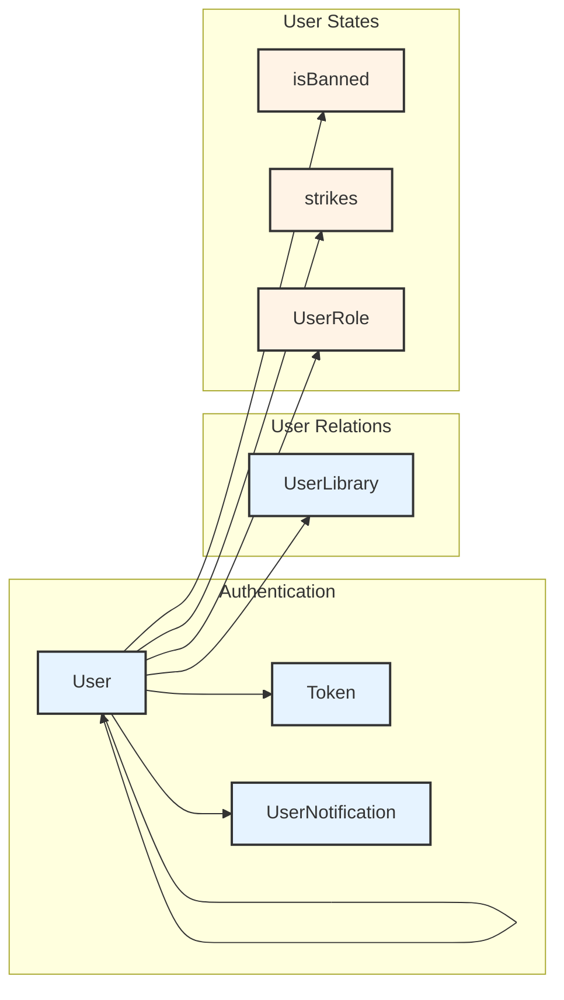

### Plant Management System
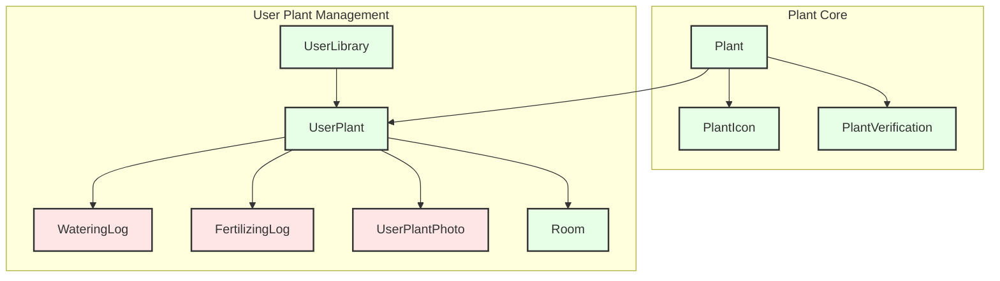

### Content Management System
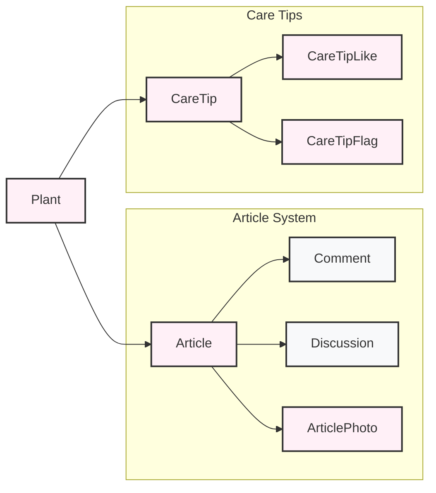

### Moderation System
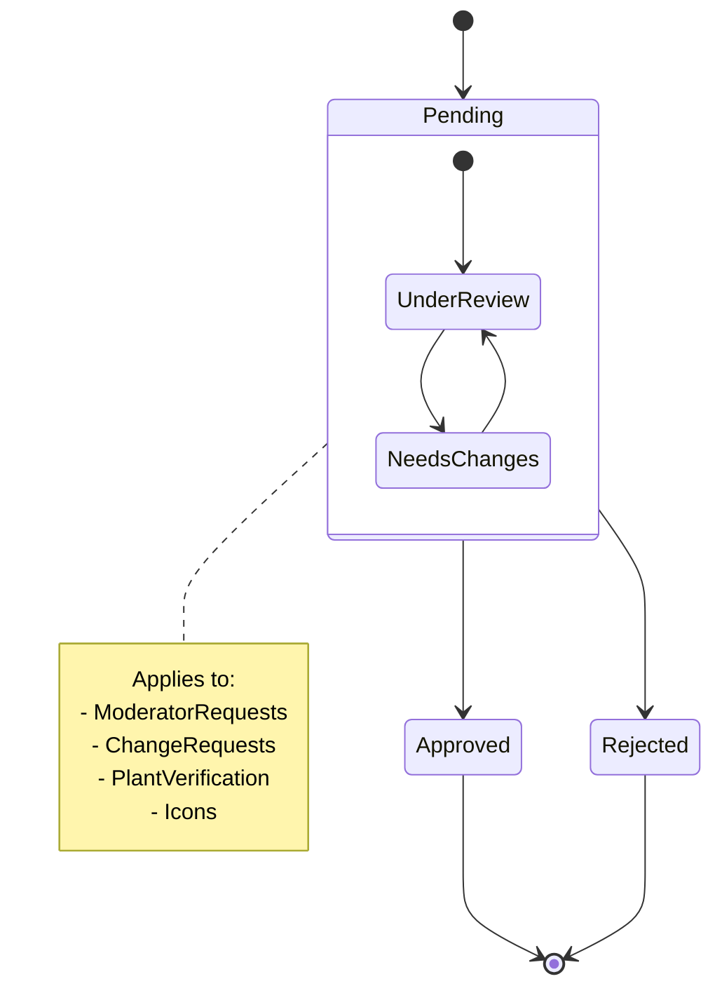

### Trading System
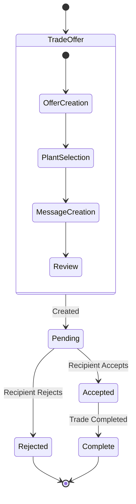

## Detailed Module Documentation

### 1. Core User System

#### User
Central entity managing user accounts and authentication.

**Key Relationships:**
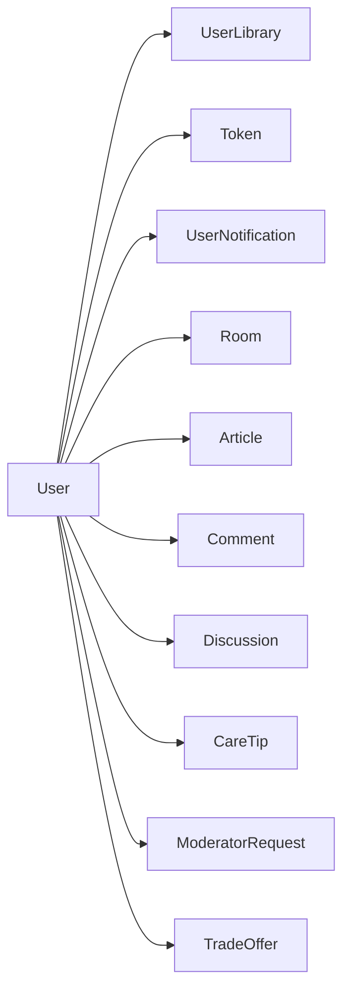


### Entity Flow Diagrams

#### Plant Creation and Verification Flow
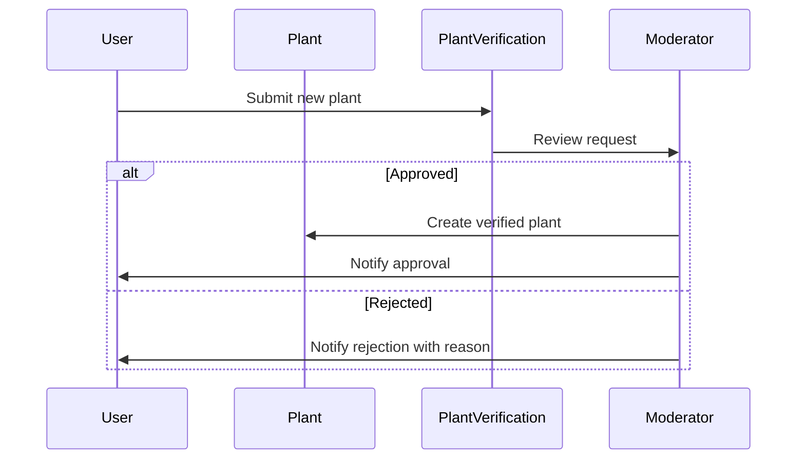

#### Trade Flow
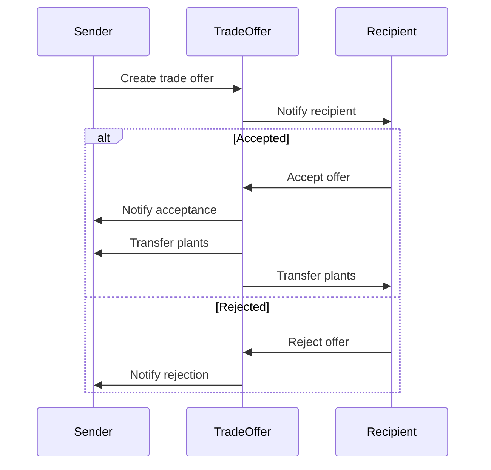

## Query Examples and Best Practices

### Common Queries with Included Relations

```typescript
// Get user with complete profile
const userProfile = await prisma.user.findUnique({
  where: { id: userId },
  include: {
    library: {
      include: {
        userPlants: {
          include: {
            plant: true,
            room: true,
            wateringLogs: { take: 5 },
            fertilizingLogs: { take: 5 }
          }
        }
      }
    },
    articles: true,
    careTips: true,
    rooms: true
  }
});

// Get plant with all related content
const plantDetails = await prisma.plant.findUnique({
  where: { id: plantId },
  include: {
    article: {
      include: {
        comments: true,
        discussions: true,
        photos: true
      }
    },
    careTips: {
      include: {
        likes: true,
        author: true
      }
    },
    icons: {
      where: { status: 'APPROVED' },
      orderBy: { version: 'desc' },
      take: 1
    }
  }
});
```


**Key Relationships:**
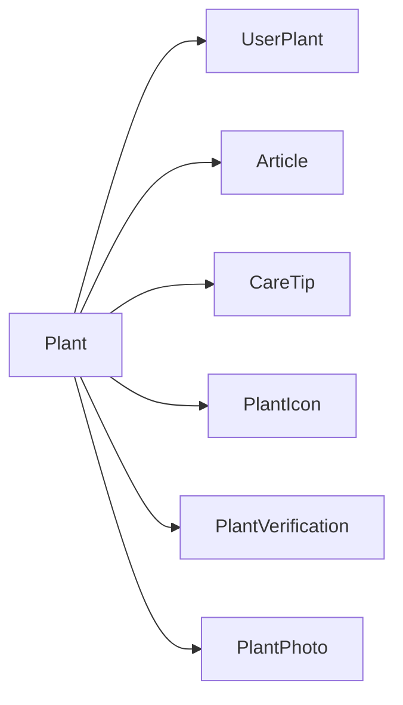

**Fields:**
| Field | Type | Description | Constraints |
|-------|------|-------------|-------------|
| id | Int | Primary key | @id @default(autoincrement()) |
| scientificName | String | Botanical name | @unique |
| commonName | String | Common name | Required |
| family | String | Plant family | Required |
| icon | String | Default icon path | Required |
| light | String | Light requirements | Required |
| temperature | String | Temperature range | Required |
| soil | String | Soil preferences | Required |
| climate | String | Climate zones | Required |
| humidity | String | Humidity needs | Required |
| growthCycle | String | Growth pattern | Required |
| toxicity | String | Toxicity info | Required |
| petSafe | Boolean | Pet safety status | Required |
| plantType | String | Plant category | Required |

#### UserPlant
Individual plant instances owned by users.

**Key Relationships:**
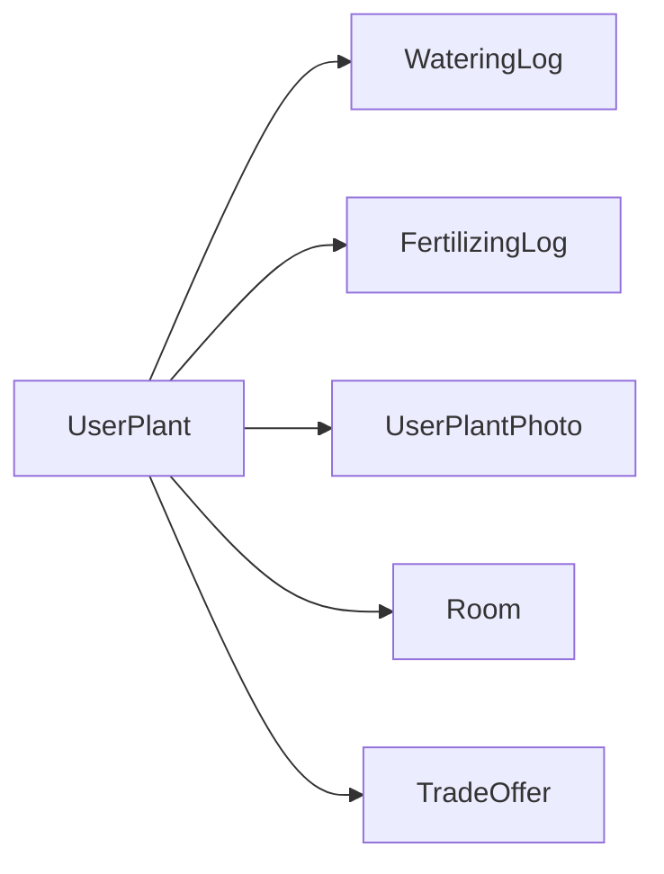

**Fields:**
| Field | Type | Description | Constraints |
|-------|------|-------------|-------------|
| id | Int | Primary key | @id @default(autoincrement()) |
| libraryId | Int | Owner's library | Required, FK |
| plantId | Int | Plant reference | Required, FK |
| nickname | String | Custom name | Optional |
| acquiredDate | DateTime | Acquisition date | Required |
| notes | String | Care notes | Optional |

### 3. Content Management System

#### Article
Comprehensive plant care guides.

**Key Relationships:**
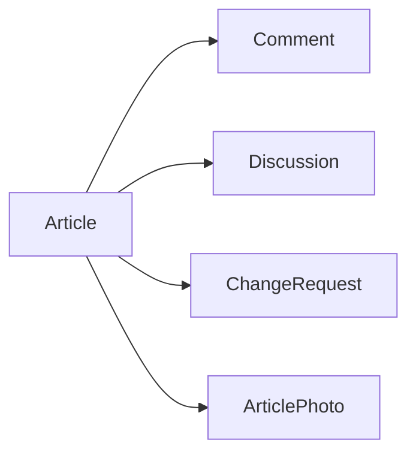

**Fields:**
| Field | Type | Description | Constraints |
|-------|------|-------------|-------------|
| id | Int | Primary key | @id @default(autoincrement()) |
| title | String | Article title | Required |
| content | String | Main content | Required |
| plantId | Int | Related plant | Required, FK, @unique |

#### Discussion
Threaded conversations on articles.

**Fields:**
| Field | Type | Description | Constraints |
|-------|------|-------------|-------------|
| id | Int | Primary key | @id @default(autoincrement()) |
| content | String | Message content | Required |
| articleId | Int | Parent article | Required, FK |
| authorId | Int | Author reference | Required, FK |
| parentId | Int? | Parent discussion | Optional, FK |

### 4. Moderation System

#### ModeratorRequest
User applications for moderator status.

**State Flow:**
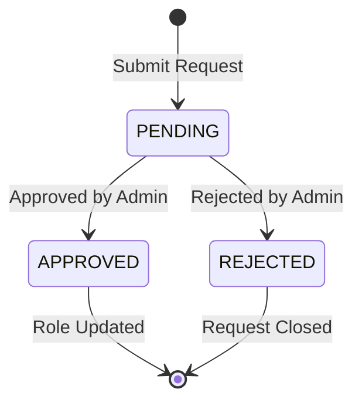

**Fields:**
| Field | Type | Description | Constraints |
|-------|------|-------------|-------------|
| id | Int | Primary key | @id @default(autoincrement()) |
| userId | Int | Applicant | Required, FK |
| status | ModeratorRequestStatus | Request state | @default(PENDING) |

#### PlantVerification
New plant entry verification system.

**Verification Flow:**
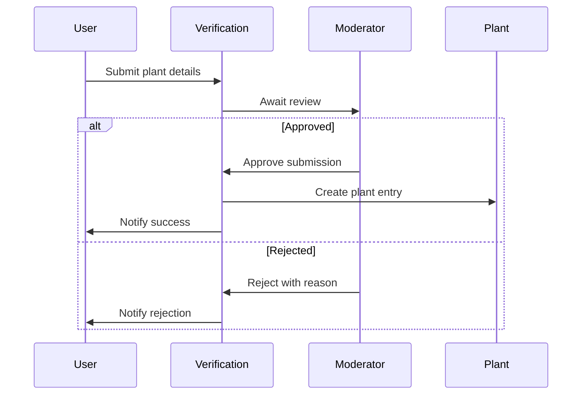

### 5. Trading System

#### TradeOffer
Plant exchange management.

**Trade Flow:**
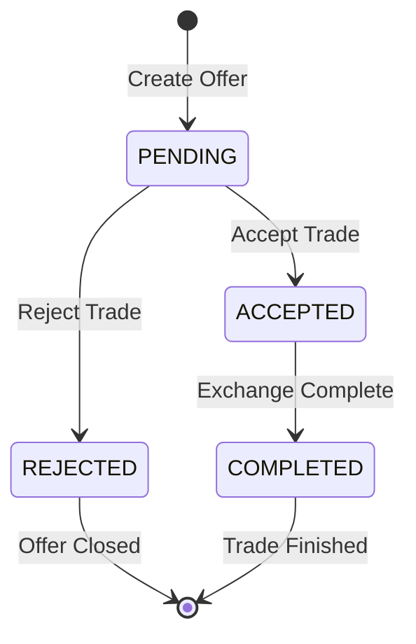

**Fields:**
| Field | Type | Description | Constraints |
|-------|------|-------------|-------------|
| id | Int | Primary key | @id @default(autoincrement()) |
| offererId | Int | Offering user | Required, FK |
| recipientId | Int | Receiving user | Required, FK |
| offeredPlantId | Int | Offered plant | Required, FK |
| requestedPlantId | Int | Requested plant | Required, FK |
| status | TradeStatus | Trade state | Required |
| message | String | Trade message | Optional |

### 6. Notification System

#### UserNotification
User alert system.

**Notification Types:**
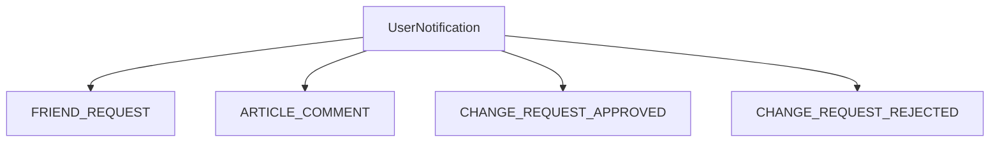

**Fields:**
| Field | Type | Description | Constraints |
|-------|------|-------------|-------------|
| id | Int | Primary key | @id @default(autoincrement()) |
| type | NotificationType | Alert type | Required |
| content | String | Message content | Required |
| userId | Int | Target user | Required, FK |
| read | Boolean | Read status | @default(false) |

## Common Queries and Patterns

### User Management

```typescript
// Create new user with library
const createUser = async (userData: UserCreateInput) => {
  return await prisma.user.create({
    data: {
      ...userData,
      library: {
        create: {} // Initialize empty library
      }
    },
    include: {
      library: true
    }
  });
};

// Get user profile with plants
const getUserProfile = async (userId: number) => {
  return await prisma.user.findUnique({
    where: { id: userId },
    include: {
      library: {
        include: {
          userPlants: {
            include: {
              plant: true,
              room: true
            }
          }
        }
      },
      rooms: true
    }
  });
};
```

### Plant Management

```typescript
// Add plant to user's library
const addPlantToLibrary = async (
  userId: number,
  plantId: number,
  data: UserPlantCreateInput
) => {
  return await prisma.userPlant.create({
    data: {
      ...data,
      library: {
        connect: { userId }
      },
      plant: {
        connect: { id: plantId }
      }
    },
    include: {
      plant: true
    }
  });
};

// Get plant with care history
const getPlantWithCare = async (userPlantId: number) => {
  return await prisma.userPlant.findUnique({
    where: { id: userPlantId },
    include: {
      wateringLogs: {
        orderBy: { date: 'desc' },
        take: 10
      },
      fertilizingLogs: {
        orderBy: { date: 'desc' },
        take: 10
      }
    }
  });
};
```

### Content Management

```typescript
// Create article with photos
const createArticle = async (
  plantId: number,
  data: ArticleCreateInput,
  photos: PhotoCreateInput[]
) => {
  return await prisma.article.create({
    data: {
      ...data,
      plant: {
        connect: { id: plantId }
      },
      photos: {
        create: photos
      }
    },
    include: {
      photos: true
    }
  });
};

// Get article with discussions
const getArticleWithDiscussions = async (articleId: number) => {
  return await prisma.article.findUnique({
    where: { id: articleId },
    include: {
      discussions: {
        include: {
          author: true,
          replies: {
            include: {
              author: true
            }
          }
        }
      }
    }
  });
};
```